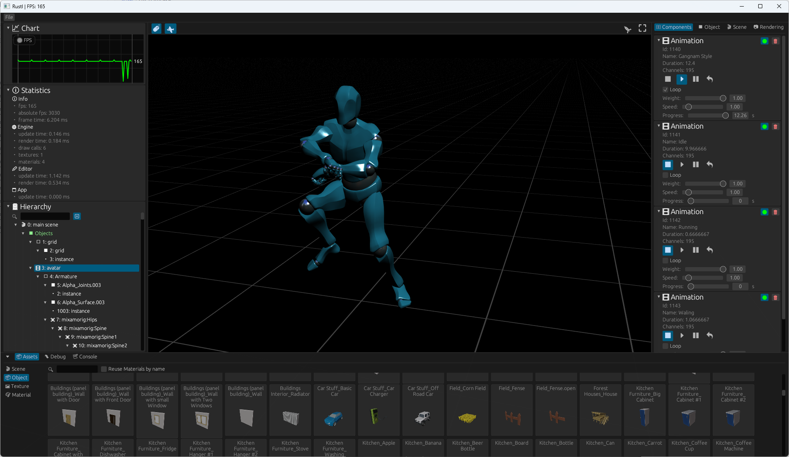
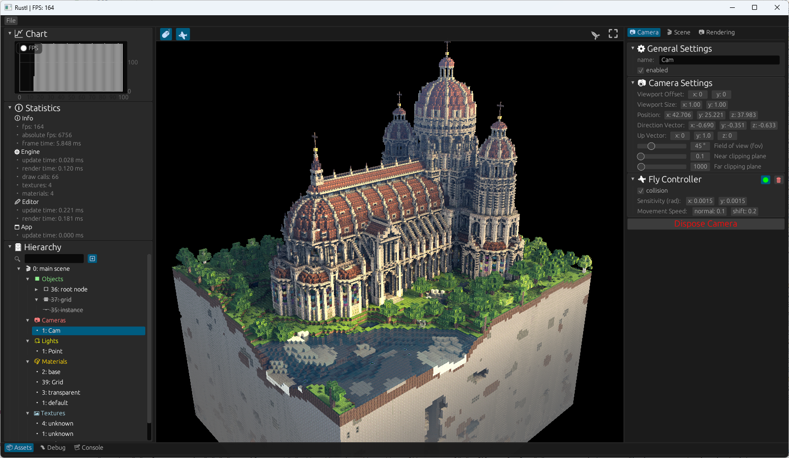

# History
Here are some screenshots which are showing the development progress.

# 2023-01-29
* Morph Targets

model/animation from: https://readyplayer.me/
  

# 2023-12-31
* Skeleton animation

model/animation from: https://www.mixamo.com/
  

model/animation from: https://www.mixamo.com/
  

# 2023-11-12
* Gamma/Exposure
* Environment mapping
* Drag and drop scene object placing

model from: https://sketchfab.com/3d-models/apocalyptic-city-a0c8f318ed6f4075a97c2e55b1272495
  

model from: https://github.com/KhronosGroup/glTF-Sample-Models/tree/master/2.0/DamagedHelmet
  

# 2023-10-05
* Editor GUI
* Statistics
* Camera movement

model from: https://sketchfab.com/3d-models/cathedral-faed84a829114e378be255414a7826ca
  

model from: https://github.com/KhronosGroup/glTF-Sample-Models/tree/master/2.0/DamagedHelmet
  

# 2023-08-09
* first GLTF/GLB loader implementation

 

# 2023-05-20
* Multi camera setup
* Normal mapping
* More UI tests

 

# 2023-05-20
* Started with phong shading

 

# 2023-05-20
* OBJ Loader (Wavefront) with my own model and unlit shading

 

# 2023-04-25
* First triangle with simple egui user interface

 

* Colored triangle with interpolated vertex colors

 