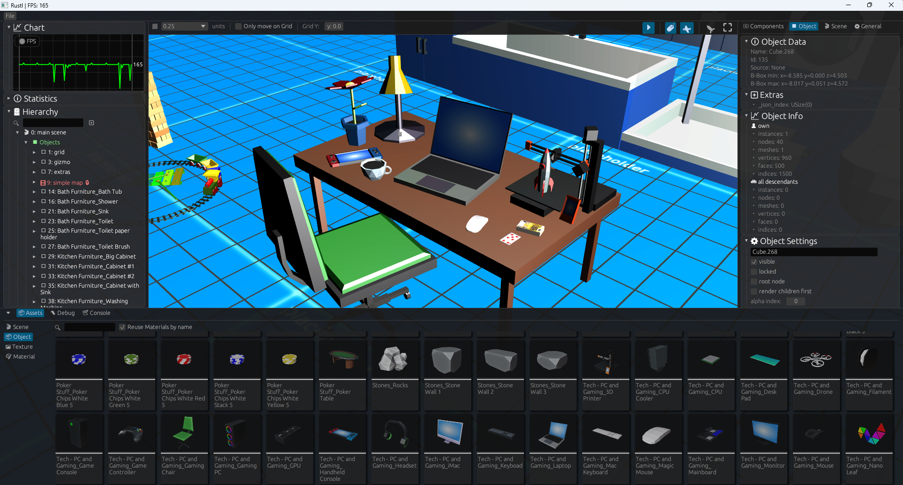
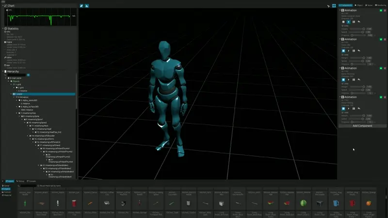
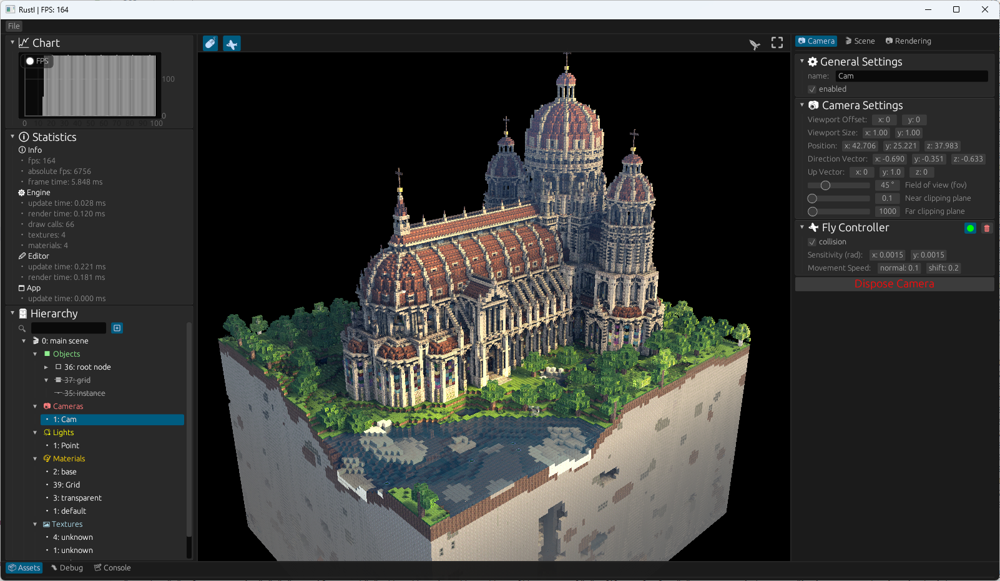
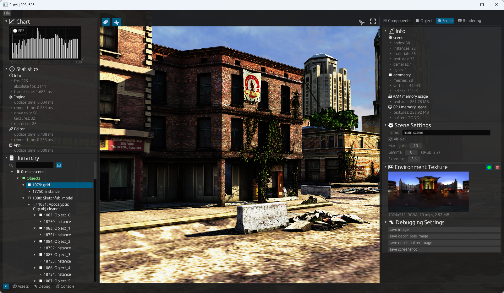

# Rustl - a game engine written in rust

* WIP (very _very_ **very** early state)
* this is going to be a game engine soon ™️ 😬 (once it's grown up)


## current state

<sub>based on own custom models</sub>
<br><br>



<sub>model/animation from: https://www.mixamo.com/</sub>
<br><br>


<sub>model from: https://sketchfab.com/3d-models/cathedral-faed84a829114e378be255414a7826ca</sub>
<br><br>


<sub>model from: https://sketchfab.com/3d-models/apocalyptic-city-a0c8f318ed6f4075a97c2e55b1272495</sub>
<br><br>

## requrements

```bash
# install

# cargo watch
cargo install cargo-watch

# wasm-pack
#https://rustwasm.github.io/wasm-pack/installer/
curl https://rustwasm.github.io/wasm-pack/installer/init.sh -sSf | sh
```

```bash
# the editor - always with the engine as shared library, it builds and runs the code of projects (scripts/dev.mjs), restarts on changes
cargo dev           # rustl without optimization (dev-dylib profile)
cargo dev-debug     # the same with full debug info for the debugger (debug-dylib)
cargo dev-release   # optimized (release-dylib)

# without editor: the game runtime, starts a .project given as argument
cargo run -- "path/to/x.project"
```

```bash
# builds without the editor into dist/<platform> - scripts/build.mjs
# the project is packed in and starts directly: its whole folder (without code/ and hidden entries), files of the scenes outside of it go to external/
# a project next to other projects (old layout) only packs its scenes and the files they use
# web: wasm with threads, one time: rustup toolchain install nightly && rustup +nightly target add wasm32-unknown-unknown && rustup +nightly component add rust-src
npm run build-web -- x.project                                   # dist/web, the project is required
npm run build-web -- resources/projects/web_test/web_test.project   # the web test project
npm run build-web -- --dev x.project                             # dev build
npm run dev-web -- x.project                                     # dev build on every change (code, resources, project folder)
npx serve -p 1337                                                # in the repo root, serve.json sets the COOP/COEP headers threads need
# -> http://localhost:1337/dist/web/
# resources/ only goes in as far as needed: resources/engine_resources.txt + what the project uses via resources://, the rest is removed from dist

# native release builds, each one on its own platform (cross compiling needs that platform's linker/SDK)
npm run build-windows -- [--dev] x.project                       # dist/windows/<project name>.exe + resources/
npm run build-linux -- [--dev] x.project                         # dist/linux/<project name> + resources/
npm run build-mac -- [--dev] x.project                           # dist/mac/<project name>.app
# named like the project, app icon: the rustl logo for now (APP_ICON in scripts/build.mjs, put into the exe by scripts/windows_icon.ps1 on windows)
# builds start resources/project/app.project (the packed project), native: a .project argument wins
# release builds have no console window on windows - start with --console to get one
# all builds take --out=<dir> instead of dist/<platform> (a custom dir is not cleaned up)
# editor: File > Export > Web/Windows/... runs the same script for the open project (saved first), with a live log

# the editor and cargo run set RUST_BACKTRACE=full themselves

```

Linux (Ubuntu 24.04 +) Requirements:
```bash
sudo apt-get install pkg-config cmake libglib2.0-dev build-essential libgtk-3-dev librust-alsa-sys-dev libasound2-dev libudev-dev
```


## Hints
* prevent large scale values for objects -> this can cause flickering (because of float precision)
