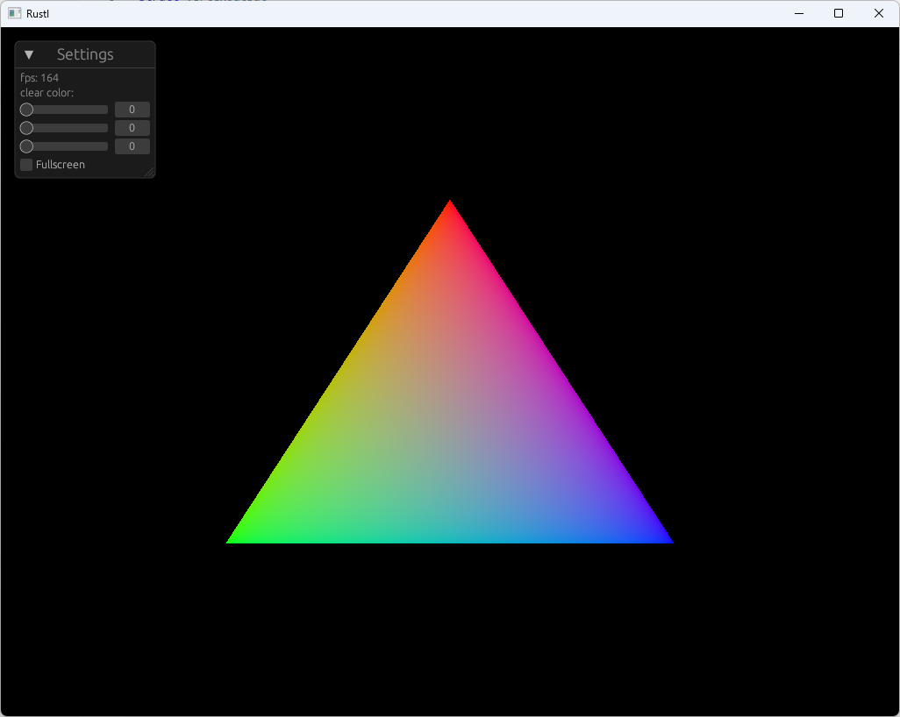

# Rustl - a game engine written in rust

* WIP (very _very_ **very** early state)
* this is going to be a game engine soon ™️ 😬


## current state

<br>

## requrements

```bash
#install

#cargo watch
cargo install cargo-watch

#wasm-pack
#https://rustwasm.github.io/wasm-pack/installer/
curl https://rustwasm.github.io/wasm-pack/installer/init.sh -sSf | sh
```


```bash

#build locally (with watch)
cargo watch -s "cargo run --release" -w src/

#build for web  (with watch)
cargo watch -s "wasm-pack build --target web" -w src/

```