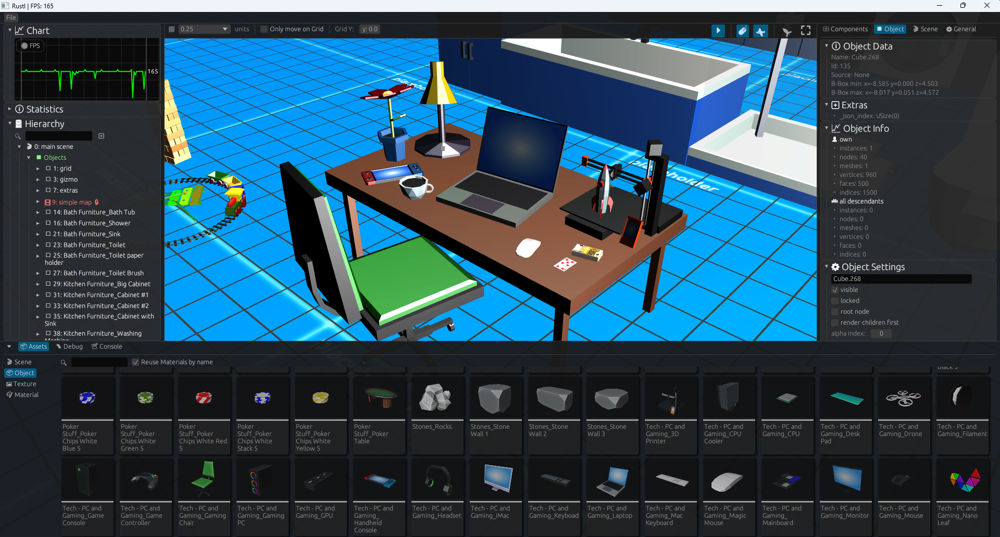
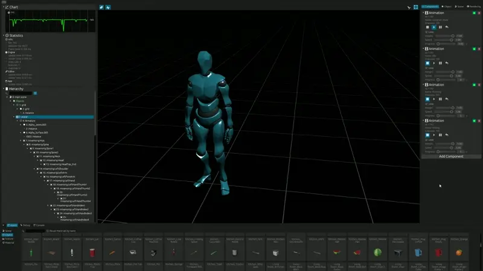

# Rustl - a game engine written in rust

* WIP (very _very_ **very** early state)
* this is going to be a game engine soon ™️ 😬 (once it's grown up)


## current state

<sub>based on own custom models</sub>
<br><br>



<sub>model/animation from: https://www.mixamo.com/</sub>
<br><br>


<sub>model from: https://sketchfab.com/3d-models/cathedral-faed84a829114e378be255414a7826ca</sub>
<br><br>


<sub>model from: https://sketchfab.com/3d-models/apocalyptic-city-a0c8f318ed6f4075a97c2e55b1272495</sub>
<br><br>

## requrements

```bash
# install

# cargo watch
cargo install cargo-watch

# wasm-pack
#https://rustwasm.github.io/wasm-pack/installer/
curl https://rustwasm.github.io/wasm-pack/installer/init.sh -sSf | sh
```


```bash

# build locally (with watch)
cargo watch -s "cargo run --release" -w src/ -w resources/

# build for web  (with watch)
cargo watch -s "wasm-pack build --target web" -w src/ -w resources/

# run with backtrace (on windows)
set RUST_BACKTRACE=1 && cargo watch -s "cargo run --release" -w src/ -w resources/

# run with backtrace (mac/linux)
RUST_BACKTRACE=1 cargo watch -s "cargo run --release" -w src/ -w resources/

```

Linux (Ubuntu 24.04 +) Requirements:
```bash
sudo apt-get install pkg-config cmake libglib2.0-dev build-essential libgtk-3-dev librust-alsa-sys-dev libasound2-dev libudev-dev
```


## Hints
* prevent large scale values for objects -> this can cause flickering (because of float precision)