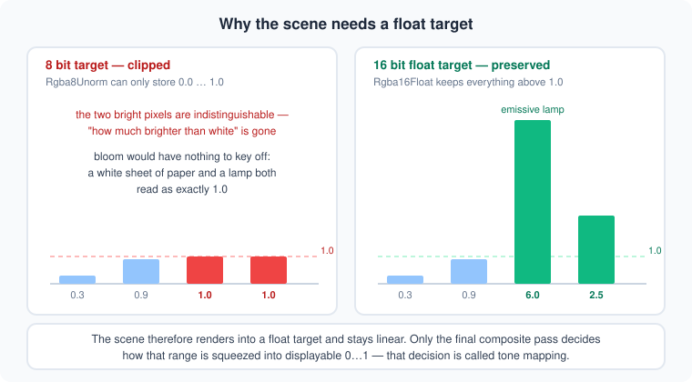
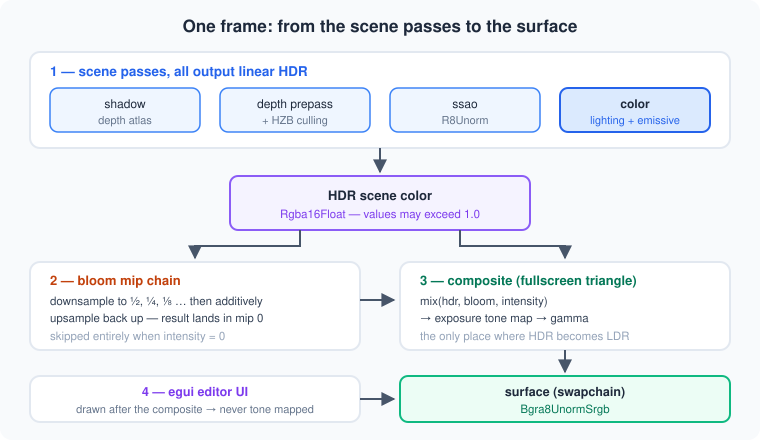
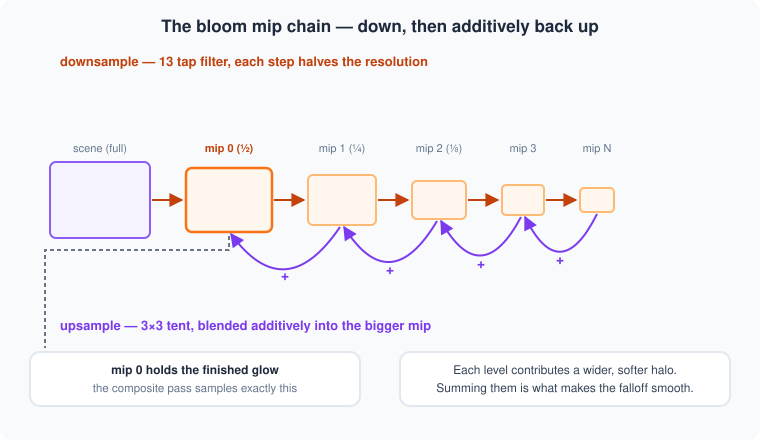
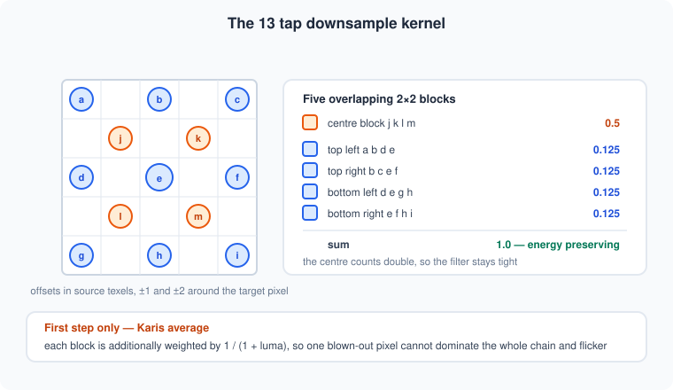
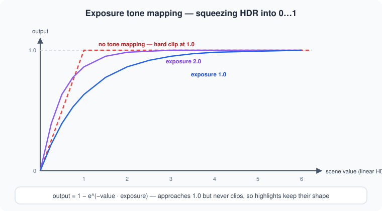

# HDR Rendering & Bloom

How the engine renders in high dynamic range and turns bright surfaces into a
glow — explained from the ground up. This is a concept doc: it doesn't mirror
the code 1:1, but the implementation (`src/rendering/post_process.rs`,
`src/rendering/wgpu.rs`, `resources/shader/base.wgsl`,
`resources/shader/bloom.wgsl`, `resources/shader/composite.wgsl`)
follows exactly these ideas.

## The core idea

A monitor can only display values from 0 to 1 — "black" to "as bright as this
panel gets". The *world* is not like that. A lamp is not 1.0, it is 20× brighter
than the sheet of paper next to it. If the renderer writes its result straight
into an 8-bit target, everything above 1.0 is clipped away and that information
is gone forever:



So the scene renders into a **float** target and stays **linear** — no tone
mapping, no gamma, nothing clamped. A separate fullscreen pass at the end of
the frame decides how that open-ended range becomes a displayable image. That
pass is also the natural place to add bloom, because it is the only point where
the true, unclipped brightness of every pixel is still available.



Two consequences fall out of this split, and both matter:

- Everything that draws into the scene color target must use the HDR format —
  the color pass, the depth prepass, the MSAA buffer, the debug volumes. A
  single pipeline still declaring the swapchain format is an instant validation
  error.
- The editor UI is drawn **after** the composite, straight onto the swapchain.
  It therefore never gets tone mapped, which is what you want: a slider should
  not change brightness when the scene exposure changes.

## The HDR target

The scene color target is `Rgba16Float` (`Texture::HDR_FORMAT`) — 16 bit float
per channel, so values well above 1.0 survive with plenty of precision. It is a
single texture owned by `WGpu`, recreated on every window resize.

With MSAA enabled the scene renders into a multisampled HDR texture that
**resolves into** the HDR target. Resolving in linear float space is strictly
better than resolving after tone mapping — the average of two HDR samples is a
meaningful brightness, the average of two clipped ones is not.

One detail worth knowing: MSAA sample counts are queried against the HDR format,
not against the swapchain format, and multisampling is only offered when that
format also reports `MULTISAMPLE_RESOLVE`. Those are two independent
capabilities, and a format can support one without the other.

## Emissive materials — what actually glows

Bloom is thresholdless here: nothing is tagged as "a bloom object". A surface
glows for exactly one reason — its color exceeds 1.0. The material property that
gets it there is **emissive**:

```wgsl
// rgb = emissive color, a = emissive strength (hdr multiplier)
var emissive_color = material.emissive_color.rgb * material.emissive_color.a;
if (has_emissive_texture())
{
    emissive_color *= sample_material_texture(tex_emissive, /* … */).rgb;
}
```

The color itself stays in the usual 0…1 range (it is a color picker, after all)
and `emissive strength` — a 0…20 slider in the material panel — is what pushes
it into HDR. Strength 1 with a mid-grey color is a dull self-lit surface;
strength 8 with the same color is a lamp.

Where it lands in the shader matters:

```wgsl
color += ambient_color * ssao_factor;
color += emissive_color;    // independent of lighting, deliberately not occluded by ssao
// … fog is applied after this
```

Emissive is added *after* the lighting loop, so it does not care about lights,
normals or shadows — a self-lit surface is lit whether or not anything shines on
it. It is deliberately excluded from ambient occlusion for the same reason: a
lamp in a corner does not get darker because it sits in a corner. Fog, on the
other hand, is applied afterwards and *does* affect it, which is correct — a
distant lamp in haze really does wash out.

### Where emissive comes from when loading

| Format   | Source |
|----------|--------|
| glTF     | `emissive_factor` + `KHR_materials_emissive_strength` (defaults to 1.0) |
| Wavefront| `Ke` for the color, `map_Ke` for the texture |

Note that the emissive texture is its own material slot (`TextureType::Emissive`),
separate from ambient. The two are easy to confuse because both add light that
isn't tied to a light source, but they behave differently: ambient is a flat
fill term that ambient occlusion darkens, while emissive is a surface emitting
on its own and is deliberately left untouched by occlusion.

### Selection tint and HDR

The editor's highlight/locked tint clamps the color before mixing:

```wgsl
color = (clamp(color, vec3(0.0), vec3(1.0)) * 0.5) + (material.highlight_color.rgb * 0.5);
```

Without the clamp, a strongly emissive object would drown the tint — mixing a
green tint into a value of 12.0 is invisible. Clamping first costs the object
its glow while selected, which is the right trade: selection feedback has to be
readable.

## The bloom chain

Bloom simulates light bleeding inside a lens: bright spots spill over their
edges. A single wide blur would be enormously expensive, so the standard trick
(the "Call of Duty: Advanced Warfare" approach) is a **mip pyramid** — blur
cheaply at many resolutions and add them up.



The chain starts at half resolution and goes down from there:

```rust
let bloom_width  = (width / 2).max(1);
let bloom_height = (height / 2).max(1);

let max_mips = (bloom_width.min(bloom_height) as f32).log2().floor() as u32;
let bloom_mip_count = max_mips.saturating_sub(2).clamp(1, 7);
```

At 1920×1080 that gives 7 levels, the smallest being 15×8 texels. The `- 2`
keeps the chain from collapsing into single pixels, where the filter kernels
would produce nothing but noise.

Each level is one render pass into a single-mip view of a shared texture. Going
down uses a 13-tap filter, coming back up a 3×3 tent — and the upsample passes
use `LoadOp::Load` with an **additive blend state** (`src = ONE, dst = ONE`), so
each level accumulates on top of the bigger one instead of replacing it. The
finished glow ends up in mip 0.

### The 13-tap downsample

A plain 2×2 box filter aliases badly across a mip chain. The 13-tap kernel
samples five overlapping 2×2 blocks instead:



```wgsl
var color = taps.e * 0.125;                                     // centre
color += (taps.a + taps.c + taps.g + taps.i) * 0.03125;         // corners
color += (taps.b + taps.d + taps.f + taps.h) * 0.0625;          // edges
color += (taps.j + taps.k + taps.l + taps.m) * 0.125;           // inner block
```

The weights sum to exactly 1.0, so the filter neither brightens nor darkens
across the chain — important when the result is added back five times over.

### Fireflies and the Karis average

One problem is specific to HDR: a single pixel at 800.0 (a specular glint, a
sub-pixel highlight) survives every downsample step and pulses across a huge
area as the camera moves. It is one flickering pixel turned into a flickering
blob.

The fix is applied in the **first** downsample only, where the input is still
the raw scene: weight each 2×2 block by `1 / (1 + luma(block))` before averaging.
Blocks that are already extremely bright contribute proportionally less, which
caps the influence of an outlier without touching normal highlights. Once the
chain is running, the values are averaged enough that the correction is no
longer needed — and applying it further down would visibly eat the glow.

## The composite pass

One fullscreen triangle turns the HDR scene color into the final image:

```wgsl
var color = textureSampleLevel(t_hdr, s_linear, in.uv, 0.0).rgb;

if (composite.bloom_intensity > 0.0001)
{
    let bloom = textureSampleLevel(t_bloom, s_linear, in.uv, 0.0).rgb;
    color = mix(color, bloom, composite.bloom_intensity);
}

if (composite.exposure > 0.0001) { color = vec3(1.0) - exp(-color * composite.exposure); }
if (composite.gamma    > 0.0001) { color = pow(max(color, vec3(0.0)), vec3(1.0 / composite.gamma)); }
```

Bloom is a **mix**, not an addition — intensity 0.05 means "5% blurred, 95%
original". That keeps the overall brightness roughly stable as you turn it up,
but it also means an intensity near 1.0 would replace the image with pure blur.
Useful values sit around 0.03 – 0.15.

Tone mapping is exponential exposure:



The curve approaches 1.0 asymptotically and never reaches it, so a value of 3.0
and a value of 30.0 still map to *different* output values. That is the whole
point — highlights keep their internal structure instead of turning into flat
white blobs.

Both steps use 0.0 as "disabled", and both default to off:

- **Exposure** is per scene and unset by default, which makes the composite a
  pass-through: the linear HDR color is written straight to the surface and the
  sRGB encode is all that happens to it.
- **Gamma** is unset because the swapchain is already an sRGB format — the
  hardware performs the linear→sRGB encode on write. The gamma control is an
  *additional* artistic curve on top of that, not the required one.

Since exposure and gamma live on the scene but the composite is a single pass
over the whole frame, the parameters of the **first visible scene** win. With
one scene (the normal case) this is invisible; with several scenes at different
exposures it is a real limitation.

The clear color is subject to all of this as well: it clears the HDR buffer, not
the swapchain, so the background travels through the same composite as the
geometry. With exposure off that changes nothing, and with exposure on the
background is tone mapped along with everything else — which is what you want,
since a background is just another surface as far as brightness goes.

## Offscreen renders

Screenshots and material thumbnails render the same way — into their own HDR
texture, then through the same composite into a readback texture. Thumbnails do
this in a **loop**, once per material, so the post processing resources are
cached and only rebound between runs.

The split that makes this cheap is inside `PostProcess`:

| Resource | Lifetime |
|----------|----------|
| pipelines, bind group layouts, sampler, uniform buffer | created once, survive everything |
| bloom texture + mip views | rebuilt only when the resolution changes |
| bind groups | rebuilt whenever the HDR view changes |

Rebuilding a handful of bind groups per thumbnail is nothing. Rebuilding four
render pipelines — which means reading two shader files and compiling them —
would dominate the entire thumbnail run.

## Performance notes

- The bloom chain costs **2·N − 1 fullscreen passes** (N downsamples, N−1
  upsamples) at half resolution and below. At 1080p that is 13 passes over a
  total area of roughly ⅔ of a full-screen pass, so it is cheap in absolute
  terms — but it runs every frame regardless of whether anything in the scene
  is actually emissive. There is no early out; turn it off per project
  (`Rendering → Bloom`) in scenes that don't need it.
- The HDR target itself doubles the scene color bandwidth versus an 8-bit
  target (8 bytes per pixel instead of 4), and MSAA multiplies that by the
  sample count. At 8× MSAA on 1080p the multisampled color buffer alone is
  ~127 MB.
- The composite pass is unconditional — even with bloom and tone mapping
  disabled the frame pays one fullscreen copy from the HDR texture to the
  swapchain. Blitting only when everything is off would save it, at the cost of
  a second code path.
- `Rgba16Float` is filterable and blendable on all desktop backends, which is
  what lets the bloom chain use linear sampling and additive blending directly.

## Code map

| Piece | Where |
|-------|-------|
| HDR target, MSAA resolve, post process ownership | `src/rendering/wgpu.rs` (`create_hdr_texture`, `recreate_post_process`, `render_post_process`) |
| bloom chain + composite resources and passes | `src/rendering/post_process.rs` |
| bloom filters (down/upsample) | `resources/shader/bloom.wgsl` |
| tone mapping + gamma + bloom mix | `resources/shader/composite.wgsl` |
| emissive shading | `resources/shader/base.wgsl` (`fs_main`) |
| emissive material properties + UI | `src/state/scene/components/material.rs` |
| material uniform layout | `src/rendering/material.rs` (`MaterialUniform`) |
| HDR format constant | `src/rendering/texture.rs` (`Texture::HDR_FORMAT`) |
| bloom settings | `src/state/state.rs` (`Rendering`), `src/gui/editor/ui/general.rs` |
| frame orchestration | `src/interface/main_interface.rs` |
| emissive import | `src/state/scene/loader/gltf.rs`, `src/state/scene/loader/wavefront.rs` |
