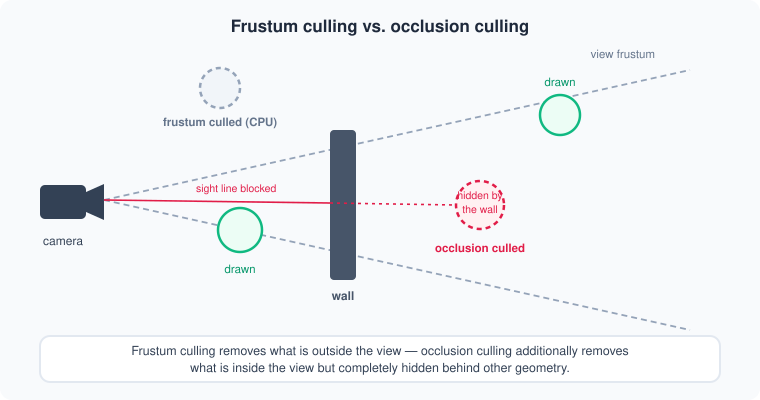
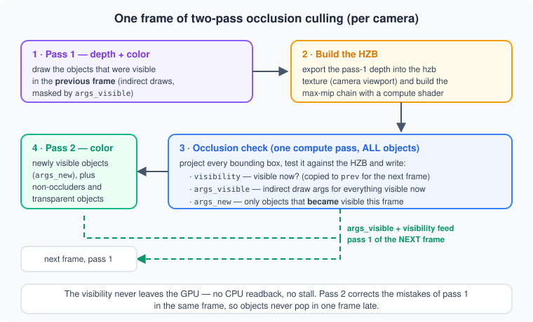
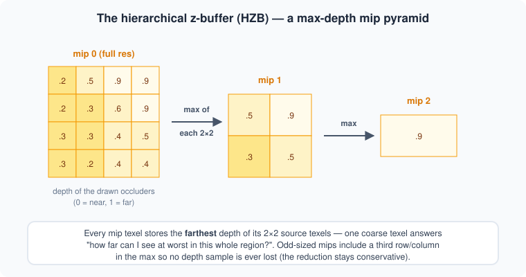
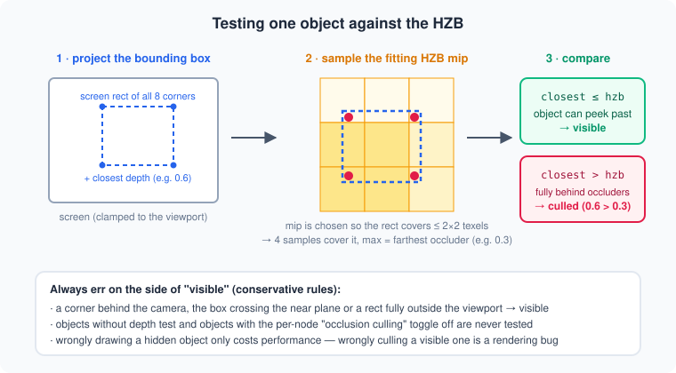
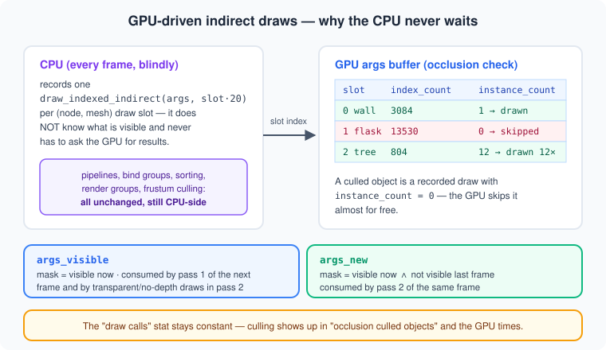

# Occlusion Culling

How the engine skips objects that are hidden behind other geometry — explained
from the ground up. This is a concept doc: it doesn't mirror the code 1:1, but
the implementation (`src/rendering/scene.rs`,
`resources/shader/compute/occlusion_hzb_check.wgsl`,
`resources/shader/compute/hzb_downsample.wgsl`,
`resources/shader/depth_export.wgsl`) follows exactly these ideas.

## The core idea

Frustum culling (CPU, per bounding sphere) removes everything *outside* the
camera's view. But a scene can still spend most of its GPU time on objects that
are inside the view and yet completely invisible — hidden behind a wall, a
building, a hill. Occlusion culling removes those too:



The hard part: "is this object hidden?" can only be answered by the depth of
everything drawn *in front* of it — which is exactly what the GPU produces
while rendering. So the test runs **on the GPU, against the depth buffer**, and
the result must never travel back to the CPU mid-frame (that would stall the
pipeline). This engine uses the standard modern recipe:
**two-pass hierarchical-z culling with indirect draws**.

## One frame, two passes

The chicken-and-egg problem of occlusion culling: to know what is hidden you
need the depth of the occluders — but which objects should you draw to get that
depth? The two-pass answer: *assume visibility barely changes between frames.*



1. **Pass 1** (depth + color) draws the objects that were visible in the
   *previous* frame. In a coherent scene that is ~99% correct.
2. The **HZB** (hierarchical z-buffer) is built from the pass-1 depth.
3. One **compute pass** tests the bounding boxes of *all* objects against the
   HZB and writes the per-object visibility plus the indirect draw arguments
   for both passes.
4. **Pass 2** (color, load — nothing is cleared) draws only the objects that
   *became* visible this frame, plus everything that can't take part in the
   depth game: transparent objects and objects without depth test/write.

Pass 2 corrects pass 1's mistakes **within the same frame** — an object that
gets disoccluded (the wall moves, the camera peeks around a corner) appears
immediately, never one frame late. That is what distinguishes true two-pass
culling from "cull with last frame's results" (which pops).

The current visibility is then copied into the "previous frame" buffer
(GPU→GPU) and becomes the input for the next frame's pass 1.

## The HZB — a max-depth mip pyramid

Testing a large object against the full-resolution depth buffer would need
thousands of samples. The HZB makes it O(1): a mip pyramid over the depth
buffer where every texel stores the **maximum** (= farthest) depth of its 2×2
source texels.



A single coarse texel then answers: *"what is the farthest anything can be seen
in this whole screen region?"* If an object's closest point is farther than
that, nothing of it can possibly peek through.

Details that matter:

- The HZB is **per camera** and covers exactly the camera's viewport. A
  fullscreen pass (`depth_export.wgsl`) copies the viewport region of the depth
  buffer into HZB mip 0 — a small uniform remaps the UVs, so cameras with
  partial viewports (quad views) work too.
- The downsample (`hzb_downsample.wgsl`) must stay **conservative** for
  non-power-of-two sizes: when a source mip has an odd width/height, the last
  row/column belongs to no 2×2 block. The shader pulls a third row/column into
  the max for those texels — otherwise a thin occludee hiding at the texture
  edge could be culled wrongly.
- Only **opaque objects with depth test + depth write** are drawn into the
  depth pre-pass, so only they can occlude. A glass pane never hides the room
  behind it.

## The occlusion test

Per object (one compute thread each), the shader in
`occlusion_hzb_check.wgsl`:



```wgsl
// project all 8 corners of the world-space AABB
let clip = camera.view_proj * vec4(corner, 1.0);
// wgpu NDC z is already 0..1 - do NOT remap with z*0.5+0.5!
let ndc = clip.xyz / clip.w;

// screen rect + closest depth over all corners, clamped to the viewport
// pick the mip where the rect covers at most ~2x2 texels
// -> 4 corner samples cover the whole rect, max() = farthest occluder

let visible = closest_depth <= hzb_depth;
```

Everything ambiguous resolves to **visible** (conservative): a corner behind
the camera, the box crossing the near plane, a rect fully outside the viewport,
an object with the per-node `occlusion culling` toggle off or without depth
test. A wrongly drawn hidden object costs a bit of GPU time; a wrongly culled
visible object is a rendering bug.

## GPU-driven indirect draws — why there is no stall

The naive way to *apply* the visibility would be: read the results back and
skip the culled objects on the CPU. That readback forces a CPU↔GPU sync every
frame and usually eats more time than the culling saves. Instead the visibility
**never leaves the GPU**:



Every (node, mesh) pair owns a fixed **draw slot** — an entry in an indirect
argument buffer (`DrawIndexedIndirectArgs`: index count, instance count, …).
The CPU records `draw_indexed_indirect(args_buffer, slot * 20)` for every
candidate, every frame, without knowing what is visible. The occlusion-check
compute pass fills in the instance counts:

| Buffer         | Mask                              | Consumed by                                            |
|----------------|-----------------------------------|--------------------------------------------------------|
| `args_visible` | visible now                       | pass 1 of the *next* frame; transparent/no-depth draws in pass 2 |
| `args_new`     | visible now ∧ not visible before  | pass 2 of the *same* frame                              |

A culled object is simply a recorded draw with `instance_count = 0` — the GPU
discards it almost for free. Everything else about the draw loop (pipeline
selection per node, bind groups, render groups, distance sorting, CPU frustum
culling) is unchanged; indirect only replaces the final `draw_indexed` call.

Two consequences worth knowing:

- The **"draw calls" stat does not change** with occlusion culling — it counts
  *recorded* draws. The culling shows up in the **"occlusion culled objects"**
  stat and in the GPU pass times.
- Draw slots are rebuilt whenever nodes/instances/meshes change; on a rebuild
  the args buffers are reset to "everything visible" so the next frame is
  always correct, and the compute pass narrows it down again.

## Anatomy of a frame (per camera)

| # | Pass                       | Draws                                              | Args buffer    |
|---|----------------------------|----------------------------------------------------|----------------|
| 1 | shadow views               | all solid casters (occlusion culling not involved) | — (direct)     |
| 2 | depth pre-pass             | opaque occluders (depth test + write)              | `args_visible` |
| 3 | color pass 1               | same set                                           | `args_visible` |
| 4 | depth export + downsample  | fullscreen triangle + compute per mip              | —              |
| 5 | occlusion check (compute)  | all objects → visibility + args                    | writes both    |
| 6 | color pass 2 (load)        | newly visible; then non-occluders + transparents   | `args_new` / `args_visible` |

Transparent objects are drawn only in pass 2 (back-to-front, after all
solids) — they can *be* culled by walls in front of them, but they never
occlude anything themselves.

## What is culled — and what never is

- **Per node**: the `occlusion culling` checkbox (object settings) opts a node
  out of the test; it is then always drawn. Baked as a flag into the bounding
  box buffer.
- **No depth test** (overlays, gizmos, grid): never tested *and* never an
  occluder — such objects are always on top of everything, so the HZB says
  nothing about their visibility.
- **X-ray mode** disables occlusion culling for the frame — it would remove
  exactly the objects x-ray is supposed to reveal.
- **WebGL** has no compute shaders and no indirect draws; the engine detects
  this at startup (`occlusion_culling_support`) and falls back to plain
  rendering. Native + WebGPU are fully supported.

## Stats & debugging

- **`occlusion culled objects`** (statistics panel): how many objects the GPU
  marked invisible. This comes from an *asynchronous* readback and is 2–3
  frames behind — by design; it never blocks the frame.
- **`frustum culled objects`**: dropped CPU-side before anything is recorded.
- **debug → save hzb image** dumps every HZB mip as PNG (`data/hzb_*.png`) —
  the fastest way to sanity-check what the culling "sees" as occluders.
- **debug → highlight visible occlusions** tints the objects the GPU currently
  considers visible.
- The GPU cost of the whole culling machinery shows as **`hzb culling`** in the
  GPU times (depth export + downsample + occlusion check).

## Performance notes

- The culling itself costs a roughly constant ~1 ms of GPU time per camera
  (viewport-sized depth export + mip chain + one tiny compute dispatch) plus
  the duplicated pass-1/pass-2 encoding on the CPU. It pays off as soon as the
  skipped objects would have cost more than that — heavy meshes behind walls,
  interiors, dense scenes. In a scene where everything is visible it is pure
  overhead: toggle it per scene as needed (`Rendering → Occlusion Culling`).
- Culling granularity is a **node** (its whole instance batch): either all
  instances of a node are drawn or none. Per-instance culling would be the
  natural next step (the compute pass would compact instance lists instead of
  just masking counts).
- Good occluders are big, closed, opaque meshes. Many small or thin occluders
  barely fill the HZB and cull little.
- The front-to-back sort of the opaque pass helps twice: early-z during
  rendering and denser HZBs for the next frame.

## Code map

| Piece                          | Where |
|--------------------------------|-------|
| frame orchestration, passes    | `src/rendering/scene.rs` (`render`, `create_hzb`, `hzb_occlusion_culling`) |
| occlusion test + args writing  | `resources/shader/compute/occlusion_hzb_check.wgsl` |
| HZB downsample                 | `resources/shader/compute/hzb_downsample.wgsl` |
| depth → HZB mip 0              | `resources/shader/depth_export.wgsl`, `src/rendering/bind_groups/depth_export.rs` |
| bounding boxes + per-node flags| `src/rendering/bounding_boxes.rs` |
| draw slots + indirect args     | `src/rendering/draw_slots.rs` |
| visibility buffers + async stats readback | `src/rendering/visibility.rs` |
| per-camera GPU resources       | `src/state/scene/camera.rs` (render items), created in `update_light_cameras_shadows` |
