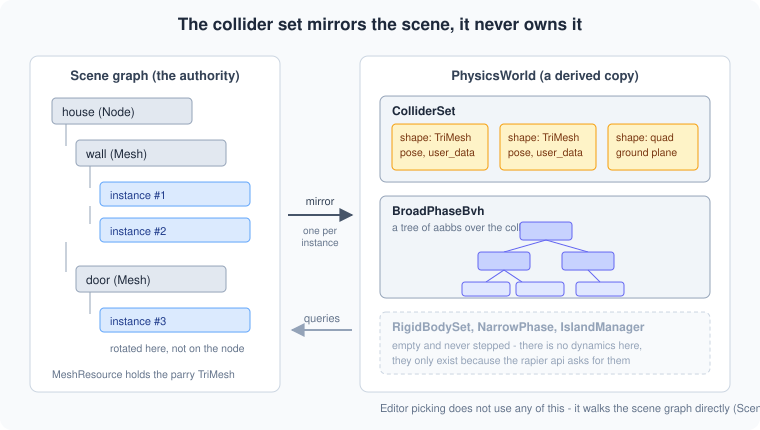
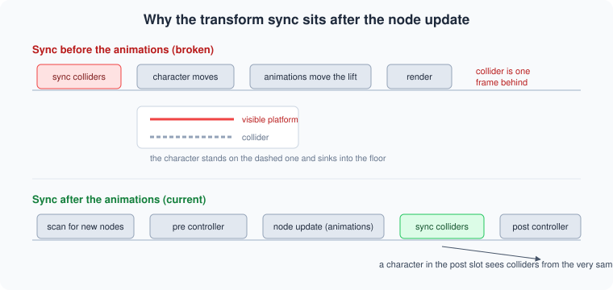

# Physics and Collision

How the engine answers "what is solid, and where" — explained from the ground
up. This is a concept doc: it doesn't mirror the code 1:1, but the
implementation (`src/state/scene/physics/physics_world.rs`,
`src/state/scene/scene_controller/char_controller.rs`,
`src/state/scene/scene.rs`) follows exactly these ideas.

## The core idea

The engine uses [rapier](https://rapier.rs/) for collision, but **not as a
physics engine**. There is no simulation step, no gravity solver, no forces, no
bouncing crates. What is used is the geometric half: a spatial index over the
scene's triangles, plus the ability to ask questions of it.

> Where does this ray hit? If I push this capsule forward, what stops it?

Everything else — gravity, jumping, movement speed — stays hand written in the
character controller, where it can be tuned to feel right rather than to be
correct.

The scene graph stays the single source of truth. The collision world is a
**derived copy** that is rebuilt and re-synced from it:

## The rapier vocabulary

Rapier's type names come from rigid body simulation, so several of them mean
less here than they sound like. This is what they are, and what this engine
actually does with them.

### Collider

A **shape** plus a **pose** (position and rotation). That's all. A collider has
no mass, no velocity, and does not move on its own. It is the answer to "what
shape sits where".

Every collidable mesh instance in the scene gets exactly one. The shape is a
`TriMesh`, built from the mesh resource's vertices and indices.

Each collider also carries a `user_data: u128`. The engine packs the scene node
id and the instance id into it, which is how a query result is traced back to
the object it hit.

### RigidBody

Mass, velocity, forces, sleeping — the actual dynamics. A collider can be
attached to one so that the solver moves it.

**This engine has none.** The `RigidBodySet` exists but stays empty, because
several rapier functions take it as a parameter. Colliders are inserted
standalone, which rapier treats as immovable world geometry.

### ColliderSet and RigidBodySet

Generational arenas. Handles are an index plus a generation counter, so a handle
to a removed collider does not silently point at whatever took its slot.

That detail matters in one place: after removing a collider the freed slot can
be reused by a later insert, so the whole BVH is rebuilt instead of trying to
patch a single leaf out of it.

### Broad phase and the BVH

The **broad phase** is the cheap first pass. Instead of testing a query against
every triangle in the level, it tests against a tree of nested bounding boxes
(a **BVH**, bounding volume hierarchy) and discards whole branches at once. A
scene with a hundred thousand triangles is reduced to a handful of candidates in
a few dozen comparisons.

`BroadPhaseBvh` owns that tree. Normally the physics pipeline updates it once
per step; here it is driven directly (see below).

### Narrow phase

The exact contact computation between a pair of shapes that the broad phase
flagged as possibly touching — contact points, normals, penetration depth. Its
output is what a dynamics solver would consume.

**Not used here.** Nothing computes persistent contacts, because nothing
simulates. Shape casts do their own exact tests internally as they go.

### Islands

In a dynamics engine, an **island** is a group of bodies that are connected
through contacts or joints and therefore have to be solved together. Islands are
also what lets a pile of boxes fall asleep as a unit once none of them moves,
so the solver can skip them entirely.

**Meaningless here**, since nothing is simulated. An `IslandManager` is kept
purely because `ColliderSet::remove` requires one in its signature.

### QueryPipeline and QueryFilter

The `QueryPipeline` is not a stored object, it is a **bundle of references** —
the BVH, the collider set, the body set, a dispatcher and a filter — assembled
on the spot for one query. That is why `PhysicsWorld::query_pipeline()` can hand
one out cheaply per call.

The `QueryFilter` decides what a query ignores. It can exclude by body type, by
collision groups, by a single handle, or through a predicate. The character
controller uses a predicate that rejects colliders whose packed node id belongs
to the character itself.

### Ray cast vs shape cast

A **ray cast** asks where an infinitely thin line first hits something. Cheap,
and what the old character controller used to find the ground.

A **shape cast** sweeps a whole shape along a direction and reports where it
first touches. Much more informative: it catches a wall the ray would have
slipped past, and it is what makes sliding along surfaces possible.

### What this engine uses

| Rapier concept | Used here |
|---|---|
| Collider, ColliderSet | yes, one collider per mesh instance |
| BroadPhaseBvh | yes, driven manually |
| QueryPipeline, QueryFilter | yes, for every cast |
| Shape cast, ray cast | yes |
| RigidBody, RigidBodySet | present but always empty |
| NarrowPhase | no |
| IslandManager | only to satisfy a function signature |
| PhysicsPipeline / `step()` | never called |

## Building the world

`PhysicsWorld::scan_nodes` walks the scene and reconciles the collider set with
it. A mesh instance gets a collider when all of these hold:

- the node has a mesh with vertices
- `settings.collision` is on, **including every parent** — it is inherited the
  same way visibility is
- the node is not engine internal (grid, gizmos), again including parents
- the instance's own `collision` flag is on

Colliders are per **instance**, not per node, and their pose comes from
`Instance::calculate_transform()`. This matters: a door animated by rotating its
instance leaves the node transform untouched, so anything reading only the node
would never see it move.

The node transform can carry scale, a collider pose cannot. Scale is therefore
**baked into the vertices** when the shape is built. A pure move or rotation
only updates the pose; a scale change is the one case that rebuilds the shape.

## Keeping it in sync

Two different rhythms, because the two kinds of change cost very different
amounts:

**Structure** — new objects, deleted objects, flags toggled in the editor — is
reconciled every ten frames. Walking the whole node tree every frame just to
notice a newly loaded object would be wasteful, and a fraction of a second of
delay is invisible while editing.

**Transforms** are synced every frame, for every collider. The world reads
`Instance::get_cached_world_transform()`, the same cache the renderer, picking
and the sound system use, refreshed once per frame during the node update. There
is no second parent chain walk for physics.

What the world does keep is its own copy of the last transform it *applied*, to
decide whether anything changed. That copy is not laziness: `Transformation`
carries a `ChangeTracker`, but the renderer calls `consume_change()` on it, which
clears the flag. Whoever reads it second sees nothing. An independent comparison
is the only reliable answer.

### Frame order

The transform sync has to run **after** the node update, not before it, and this
is easy to get wrong:

Animations move nodes during the node update. Syncing earlier leaves every
animated collider one frame behind its visible mesh. On a moving platform that
gap is exactly what lets a character sink into the floor and eventually fall
through it.

A character controller in the **post** slot therefore sees colliders from the
current frame. One in the pre slot is inevitably a frame behind, which the
platform riding below compensates for.

## Driving the BVH without a physics step

Normally `BroadPhaseBvh::update` is called by the physics pipeline, and it
depends on per-collider change flags that only the pipeline clears. Driving it
that way without a pipeline would work exactly once, and then quietly stop
picking up changes.

The engine uses `BroadPhaseBvh::set_aabb` instead. It applies one collider's
box to the tree immediately and consults no flags. Rapier documents this path
explicitly for pipeline-less use.

Structural changes — an insert or a remove — rebuild the tree from scratch. That
is O(n) but rare, and it sidesteps the generational slot reuse problem entirely.

## The ground plane

An optional endless floor, independent of any scene node. Without it a character
in an empty scene simply falls forever, and the editor grid cannot serve as one:
it is a visual helper that gets deleted and rebuilt whenever the grid settings
change.

Its shape has a small story. A parry `HalfSpace` would fit best, but its
bounding box is infinite and the BVH rejects non-finite leaves. A very large
flat cuboid was tried next and turned out to be numerically poor: at half
extents of 5000 by 1, the capsule-versus-box contact swung the character over a
6 cm range while standing perfectly still, which showed up as the feet flickering
below and above the grid.

It is a two triangle quad now, which measured exact at every size tried, and it
matches how real level geometry is represented anyway.

## The character controller

Movement runs on rapier's `KinematicCharacterController`, driven with a capsule.
The controller does not simulate anything — it takes a desired translation, casts
the capsule through the world, and returns how far the character may actually
move, plus whether it ended up grounded.

Around that sit a handful of decisions that are not obvious from the API:

**The capsule is measured, not configured.** Radius, half height and centre
offset come from the character's bounding box. The measurement is deferred until
the idle animation actually poses the skeleton, because the bind pose of a
character is a T-pose whose arm span would give a comically wide capsule. The
radius uses the *smaller* horizontal extent for the same reason. It is a one
shot, so a hand tuned capsule is never silently resized.

**Gravity acts only in the air.** Pushing a grounded character into the floor
every frame forces the controller to resolve a penetration every time, and that
occasionally eats the whole iteration budget so the horizontal step is dropped.
Measured over 600 frames of walking, that stalled 16 frames completely — visible
as a stutter while running.

**Snap to ground has a low ceiling.** Snapping keeps the character glued to the
floor over small bumps. Set too large it does the opposite: the downward cast
overshoots and buries the capsule. With a slim capsule a value of 0.2 dragged the
character 10 cm under the floor while walking. 0.03 never sinks.

**A grounded report while rising is not a landing.** The controller reports
grounded as long as the capsule has not cleared the floor, which on the first
frame of a jump is still true. Treating that as a landing zeroes the upward
velocity and cancels the jump before it starts.

**Moving platforms are ridden explicitly.** The controller remembers the collider
under the feet and where it was last frame. If it moved, that delta is applied
to the character before the shape cast, so a lift does not slide out from under
it.

**The character is excluded from the world entirely**, not just filtered at query
time. Its meshes are skinned, so their world transform changes every frame, which
would re-sync them constantly for geometry that must never block its own
controller.

## What is deliberately absent

**No dynamics.** Nothing falls over, nothing gets pushed. Adding it means running
`PhysicsPipeline::step`, which changes the ownership model: rapier would then move
bodies and the scene graph would follow, instead of the other way round.

**Editor picking is a separate system.** `Scene::pick` walks the scene graph and
casts against mesh nodes directly. It answers a different question — it needs face
ids and instance ids, it picks gizmos and grid lines that have no collider at all,
and it deliberately picks invisible nodes. The two are not redundant.

**Concave corners really do stop the character.** Sliding works along a wall and
along anything flush with it. Where a protruding, tilted panel meets a wall, the
wall, the panel's side face and the floor together leave no direction to slide
in, and the character stops. That is geometrically correct, and it resolves the
moment the player stops pushing into the wall. Decorative geometry should have
its `collision` flag turned off rather than be worked around.
