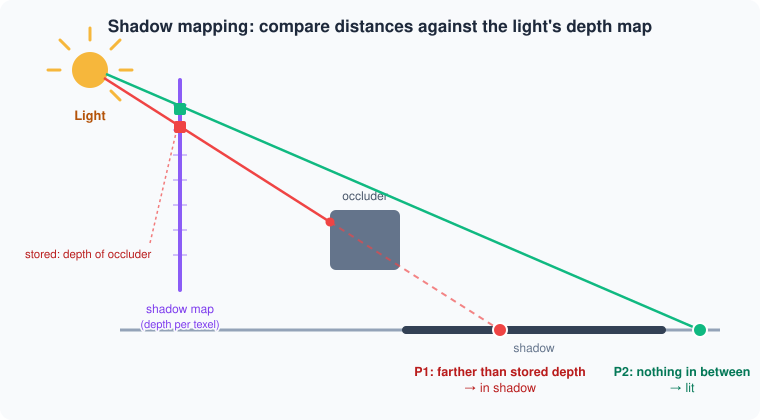
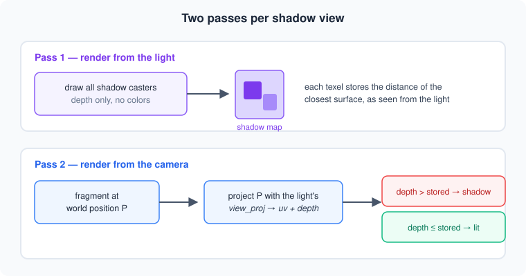
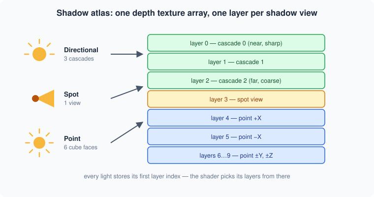
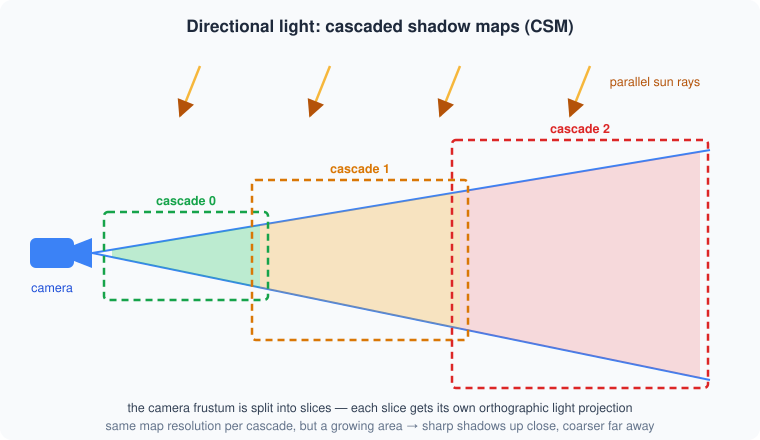
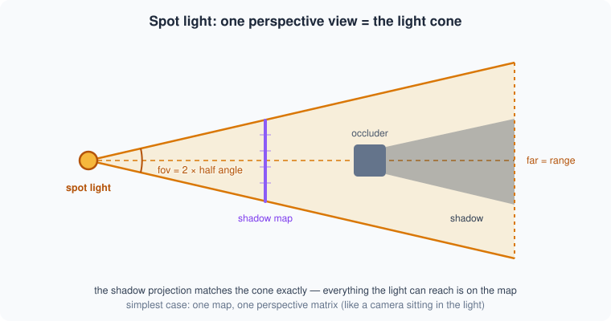
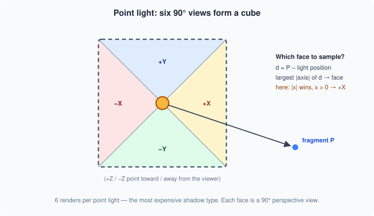
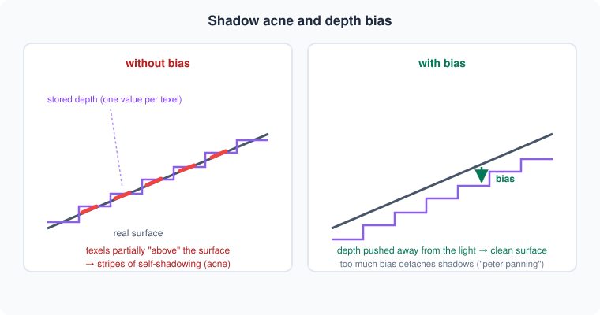
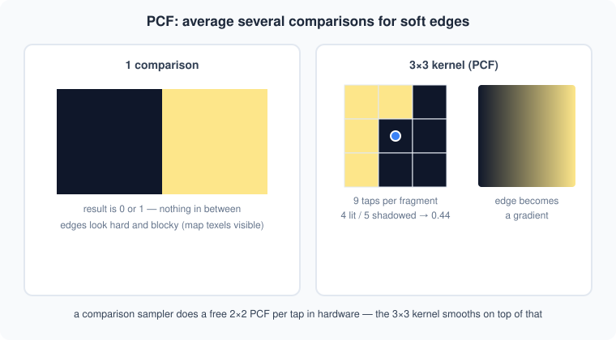
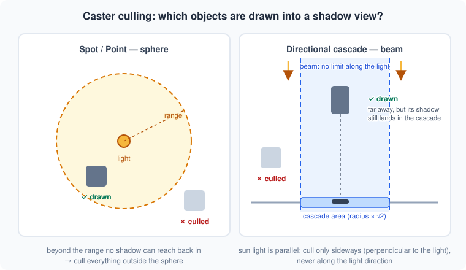

# Shadow Mapping

How real-time shadows work in this engine — explained from the ground up.
This is a concept doc: it doesn't mirror the code 1:1, but the implementation
(`src/rendering/shadow.rs`, `resources/shader/shadow.wgsl`, `resources/shader/base.wgsl`)
follows exactly these ideas.

## The core idea

A GPU cannot ask "is something between this point and the light?" directly.
Shadow mapping answers the question with a depth image instead:

1. Render the scene **from the light's point of view** — but store only *depth*
   (distance to the nearest surface), no colors. This image is the **shadow map**.
2. Render the scene normally from the camera. For every pixel, project its world
   position into the light's view and compare: is this point **farther away** from
   the light than what the shadow map recorded there? Then something is in front
   of it → it is in shadow.





The comparison in shader pseudo-code:

```wgsl
let clip = light_view_proj * vec4(world_pos, 1.0);
let ndc  = clip.xyz / clip.w;                    // -1..1
let uv   = vec2(ndc.x, -ndc.y) * 0.5 + 0.5;      // shadow map coordinates
let lit  = textureSampleCompare(shadow_map, cmp_sampler, uv, ndc.z - bias);
// lit = 1.0 → visible from the light, 0.0 → in shadow
```

## The shadow atlas

Every shadow "view" (a single depth render) gets one layer of a shared
`Depth32Float` texture array — the **shadow atlas**. One pipeline renders all
views; each light only stores the index of its first layer.



| Light type  | Views | Why |
|-------------|-------|-----|
| Directional | 3     | one cascade per distance range (see below) |
| Spot        | 1     | the cone is a single perspective view |
| Point       | 6     | light shines in all directions → cube faces |
| Hemispheric | 0     | pure ambient light, casts no shadows |

## Directional lights — cascaded shadow maps (CSM)

A sun has no position and covers the whole world. One map over everything would
be hopelessly blurry up close. The trick: split the **camera frustum** into
slices and fit one orthographic light projection snugly around each slice.
Near the camera the map covers a small area (sharp), far away a big one (coarse) —
which is fine, because distant shadows are small on screen anyway.



```rust
// per cascade: fit an ortho box around the frustum slice
let corners = frustum_slice_corners(camera, split_near, split_far);
let (center, radius) = enclosing_sphere(&corners);

let view = look_at(center - light_dir * distance, center, up);
let proj = orthographic(-radius, radius, -radius, radius, near, far);
```

Two details matter in practice:

- **Split placement**: a blend between logarithmic and uniform splits
  ("practical split scheme") gives near cascades more resolution.
- **Texel snapping**: the ortho box is quantized to whole shadow-map texels.
  Without it, shadow edges shimmer as soon as the camera moves.

In the fragment shader, the *first cascade that contains the point* wins —
smaller index = sharper map.

## Spot lights

The easy case. A spot light already is a camera: it has a position, a direction
and an opening angle. One perspective projection with `fov = 2 × half angle`
and `far = range` covers exactly the lit cone.



```rust
let proj = perspective(aspect: 1.0, fovy: max_angle * 2.0, near, far: range);
let view = look_at(light_pos, light_pos + light_dir, up);
```

## Point lights

A point light shines in **all** directions — no single projection can cover
that. So it renders six 90° views (like a cube map): +X, −X, +Y, −Y, +Z, −Z.
That makes point lights the most expensive shadow casters (6 depth passes).

When shading a pixel, the shader picks the face by looking at the direction
from the light to the pixel: whichever axis has the largest absolute value
selects the face.



```wgsl
let d = world_pos - light_pos;
let a = abs(d);
var face = 0u;                                        // +X
if      (a.x >= a.y && a.x >= a.z) { face = select(1u, 0u, d.x > 0.0); } // ±X
else if (a.y >= a.z)               { face = select(3u, 2u, d.y > 0.0); } // ±Y
else                               { face = select(5u, 4u, d.z > 0.0); } // ±Z
```

## Quality: bias & soft edges

### Shadow acne

The shadow map stores one depth value per texel, but a surface slopes *through*
that texel. Half of the surface ends up "behind" its own stored depth and
shadows itself — visible as stripe patterns (acne). The fix is a small **bias**:
push the comparison depth slightly away from the light. Too much bias creates
the opposite artifact — shadows detach from their objects ("peter panning").



Two biases work together here:
a hardware **slope-scaled depth bias** in the shadow pipeline (steeper surface →
more bias) plus a small constant per-light bias, tweakable in the editor.

### PCF — percentage closer filtering

A raw depth comparison yields 0 or 1 → hard, blocky edges. You also cannot
blur a shadow map (averaged depths are meaningless). PCF instead makes
*several comparisons* around the pixel and averages the **results**:



```wgsl
var lit = 0.0;
for (var y = -1; y <= 1; y++) {
    for (var x = -1; x <= 1; x++) {
        let offset = vec2(f32(x), f32(y)) * spread * texel_size;
        lit += textureSampleCompareLevel(shadow_map, cmp_sampler, uv + offset, layer, depth);
    }
}
lit /= 9.0;
```

The comparison sampler is the key trick: the GPU compares 4 neighboring texels
and bilinearly blends the *results* — a free 2×2 PCF per tap. The 3×3 kernel on
top gives smooth penumbras; the kernel spread is the material's `shadow softness`.

## Caster culling — what gets drawn into a shadow view?

Rendering *every* object into *every* shadow view would multiply the scene's draw
calls by the number of views. So each view carries a cull volume, and an object
(by its bounding sphere) is only drawn if it could actually cast into that view.
The key question is not "can the camera see it?" but **"can its shadow land on
the map?"** — and the right volume differs per light type:

- **Spot / point → sphere.** The light's influence ends at its range. A shadow
  can never be closer to the light than its caster, so anything outside the
  sphere around the light can be skipped.
- **Directional cascade → beam.** Sun light is parallel: a tower far outside
  the cascade's fitted sphere — *toward* the sun — still drops its shadow right
  into the cascade. Culling along the light direction is therefore forbidden;
  only sideways (perpendicular to the light) is safe. The volume is an infinite
  cylinder ("beam") along the light direction through the cascade center.



The beam test is a vector rejection — compute the object's offset, split it into
"along the light" and "perpendicular", and only compare the perpendicular part:

```rust
let to_center      = obj_center - cascade_center;
let along          = to_center.dot(light_dir);          // ignored on purpose
let perpendicular  = to_center - light_dir * along;     // sideways distance

perpendicular.norm() <= cascade_radius * SQRT_2 + obj_radius
```

The `√2` matters: the square shadow map *circumscribes* the fitted sphere, so
its corner regions reach `radius · √2` from the axis. Culling with the plain
radius would silently drop casters whose shadows land in the map corners —
shadows would flicker out near cascade transitions.

## Performance notes

- **Resolution** is the biggest knob: a 2048² depth layer costs 16 MB and fill
  rate; 1024² costs a quarter of that. Configurable in the editor
  (`Rendering → Shadow Map Res`).
- **Per-view culling**: each shadow view only draws objects that can actually
  cast into it (sphere test for spot/point, axis-distance test for cascades).
- **Casters are filtered** per material (`cast shadow`) and transparent objects
  never cast.
- Point lights cost 6 passes — prefer spots where the scene allows it.
- Not implemented yet, but the natural next step: **caching** — skip re-rendering
  shadow views whose light and casters didn't move.
